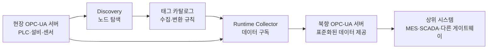

# OPC-UA Middleware Gateway

## 개요

이 프로젝트는 현장 OPC-UA 서버에서 데이터를 수집하고, 이를 상위 시스템에 다시 OPC-UA 방식으로 제공하는 게이트웨이입니다.

게이트웨이는 동시에 두 가지 역할을 수행합니다.

- 현장 설비와 연결할 때는 **OPC-UA 클라이언트**
- 상위 시스템과 연결할 때는 **OPC-UA 서버**

이를 통해 상위 시스템은 설비 제조사별 OPC-UA 구조를 직접 이해하지 않아도, 게이트웨이가 제공하는 일관된 주소와 구조로 데이터를 조회할 수 있습니다.

## 전체 구조



## 핵심 운영 방식

게이트웨이는 노드 탐색과 실제 데이터 수집을 분리합니다.

### 1. Discovery: 노드 탐색

Discovery는 현장 OPC-UA 서버의 주소 공간을 탐색하는 과정입니다.

주요 역할은 다음과 같습니다.

- 서버가 제공하는 설비와 센서 노드 확인
- NodeId, 네임스페이스, 데이터 형식 등의 정보 수집
- 탐색 결과를 태그 카탈로그 후보로 생성
- 기존 카탈로그와 비교하여 추가·변경·삭제된 노드 확인

Discovery 결과가 즉시 운영에 반영되는 것은 아닙니다. 필요한 태그를 검토하고 활성화한 뒤 Runtime에서 사용합니다.

#### 실행 방법

```bash
# 현장 서버 전체를 탐색해 카탈로그(catalog/tags.yaml)에 신규 후보를 추가
python main.py discover

# 파일은 바꾸지 않고 결과만 확인
python main.py discover --dry-run

# 특정 설비 아래만 탐색
python main.py discover --root "ns=2;s=Line01"
```

접속할 서버와 카탈로그 위치는 `.env`의 `OPCUA_ENDPOINT`, `OPCUA_SERVER_ID`, `CATALOG_PATH`로 지정합니다.

#### 다시 실행하면 어떻게 되나요?

Discovery는 여러 번 실행해도 안전합니다. 운영자가 검토한 내용은 덮어쓰지 않습니다.

- **새로 발견된 노드**: `candidate` 상태, 비활성(`enabled: false`)으로 카탈로그에 추가
- **이미 있는 태그**: 그대로 유지하고, 경로나 데이터 형식이 바뀌었으면 `[변경]`으로 알림
- **서버에서 사라진 노드**: 삭제하지 않고 `[누락]`으로 알림 (일부만 탐색한 경우에는 확인하지 않음)

탐색 시 표준 OPC-UA 노드(Server 객체 등)와 Property는 태그 후보에서 제외합니다. 단, 단위 정보(EngineeringUnits)는 읽어서 `unit`에 채웁니다.

### 2. Runtime: 데이터 수집 및 제공

Runtime은 승인된 태그 카탈로그를 읽고 실제 데이터를 처리합니다.

주요 역할은 다음과 같습니다.

1. 현장 OPC-UA 서버에 접속
2. 카탈로그에 활성화된 노드 구독
3. 값과 품질 상태, 발생 시각 수신
4. 북향 OPC-UA 서버의 대응 노드 갱신
5. 상위 시스템에 일관된 구조로 데이터 제공

Runtime은 서버 전체를 반복 탐색하지 않습니다. 카탈로그에 등록된 노드만 구독하므로 동작이 예측 가능하고 불필요한 부하를 줄일 수 있습니다.

## 태그 카탈로그

태그 카탈로그는 다음 관계를 정의하는 설정 정보입니다.

> 현장 서버의 어떤 데이터를 수집하여, 게이트웨이의 어떤 노드로 제공할 것인가?

카탈로그는 단순한 노드 목록이 아니라 현장 데이터와 상위 시스템 사이의 변환 규칙입니다.

### 권장 필드

#### 식별 정보

- `tag_id`: 게이트웨이 내부에서 사용하는 고유 식별자
- `name`: 사람이 이해할 수 있는 태그 이름
- `description`: 태그 용도에 대한 설명
- `enabled`: 실제 수집 및 제공 여부
- `status`: 후보, 승인, 사용 중, 중지 등의 관리 상태

#### 현장 서버 정보

- `source_server`: 접속할 현장 서버 식별자
- `source_namespace_uri`: 노드가 속한 네임스페이스 URI
- `source_identifier`: 원본 노드의 식별자 (`s=문자열` 또는 `i=숫자` 형식)
- `source_browse_path`: 사람이 확인하기 위한 노드 경로
- `source_data_type`: 현장 서버가 제공하는 원본 데이터 형식

네임스페이스 번호(`ns=2` 등)는 서버 재시작이나 설정 변경으로 달라질 수 있습니다. 따라서 번호 대신 변하지 않는 Namespace URI를 저장합니다.

#### 북향 OPC-UA 서버 정보

- `target_path`: 게이트웨이에서 제공할 노드 경로
- `target_name`: 상위 시스템에 표시할 이름
- `data_type`: 제공할 OPC-UA 데이터 형식 (`Double`, `Float`, `Int32`, `Boolean`, `String` 등 기본 형식)
- `unit`: 온도, 압력, 속도 등의 공학 단위 (`°C`, `bar`, `rpm`, `%` 등은 표준 단위 코드로 자동 변환)
- `eu_range`: 정상 운전 시 값의 범위 (선택). 상위 시스템의 트렌드 축이나 게이지 범위에 쓰입니다. 현장 서버가 제공하면 Discovery가 자동으로 채웁니다.

#### 수집 정책

- `sampling_interval_ms`: 현장 데이터 확인 주기
- `publishing_interval_ms`: 구독 데이터 전달 주기
- `deadband`: 의미 없는 미세 변화의 전달을 줄이기 위한 기준

#### 값 변환

- `scale`: 원본 값에 적용할 배율
- `offset`: 원본 값에 더할 보정값

변환식은 다음과 같습니다.

```text
제공값 = 원본값 × scale + offset
```

### 카탈로그 예시

```yaml
tags:
  - tag_id: bearing_temperature_01
    name: 1번 베어링 온도
    description: 1번 모터의 베어링 온도
    enabled: true
    status: active

    source:
      server: production_line_01
      namespace_uri: http://vendor.example.com/machine
      identifier: s=Machine01.Bearing.Temperature
      browse_path: Machine01/Bearing/Temperature
      data_type: Double

    target:
      path: Factory/Line01/Machine01/Bearing
      name: Temperature
      data_type: Double
      unit: °C
      eu_range: {low: 0.0, high: 150.0}

    collection:
      sampling_interval_ms: 1000
      publishing_interval_ms: 1000
      deadband: 0.1

    conversion:
      scale: 1.0
      offset: 0.0
```

초기 구현에서는 YAML, JSON 또는 CSV 파일을 사용할 수 있습니다. 설정이 복잡해지거나 변경 이력과 승인 절차가 필요해지면 데이터베이스로 확장할 수 있습니다.

## 북향 OPC-UA 주소 공간

게이트웨이가 제공하는 OPC-UA 주소 공간은 현장 서버의 구조를 그대로 복제하지 않습니다.

현장 제조사나 설비 종류가 달라도 상위 시스템에서는 동일한 규칙으로 접근할 수 있도록 단순하고 안정적인 구조를 제공합니다.

예시:

```text
Objects
└── Factory
    └── Line01
        └── Machine01
            ├── Temperature
            ├── Pressure
            └── OperationStatus
```

북향 노드 구조와 NodeId는 가능한 한 변경하지 않습니다. 현장 서버의 NodeId가 바뀌더라도 카탈로그의 매핑만 수정하여 상위 시스템에 미치는 영향을 줄입니다.

### 데이터 노드가 제공하는 정보

각 데이터 노드는 값뿐 아니라 다음 정보도 함께 제공합니다.

- **현재 값**: 카탈로그의 `data_type`에 맞춰 변환된 값 (정수 형식에 소수가 들어오면 반올림)
- **품질 상태**: 정상(`Good`), 불확실(`Uncertain...`), 사용 불가(`Bad...`)
- **발생 시각**: 현장에서 값이 측정된 시각 (SourceTimestamp)
- **수신 시각**: 게이트웨이가 값을 받은 시각 (ServerTimestamp)
- **단위와 범위**: 표준 단위 코드(UNECE)와 정상 범위(`eu_range`)

숫자 태그는 OPC-UA 표준 아날로그 타입으로 만들어집니다. `eu_range`가 있으면 `AnalogItemType`, 없으면 `BaseAnalogType`입니다. 그래서 UaExpert나 SCADA가 단위와 범위를 자동으로 인식합니다.

품질 상태는 다음 상황에서 바뀝니다.

| 상황 | 품질 상태 | 값 |
| --- | --- | --- |
| 게이트웨이 시작 후 아직 값을 받지 못함 | `BadWaitingForInitialData` | 없음 |
| 정상 수신 | `Good` | 현재 값 |
| 현장 값을 노드 형식으로 바꿀 수 없음 | `BadTypeMismatch` | 없음 |
| 현장 연결 끊김 (Gateway 모드에서 적용 예정) | `UncertainLastUsableValue` | 마지막 정상 값 |

OPC-UA 규격에 따라 품질이 `Bad`이면 값은 비어 있는 상태(null)로 전달됩니다.

상위 시스템에서 값을 쓰는 것은 허용하지 않습니다.

### 게이트웨이 상태 노드

`Objects/_Gateway` 아래에서 게이트웨이 자체 상태를 확인할 수 있습니다. 값이 바뀌지 않을 때 "설비가 멈춘 것인지, 게이트웨이 연결이 끊긴 것인지"를 구분하는 데 사용합니다.

```text
Objects
└── _Gateway
    ├── StartTime           게이트웨이 서버 시작 시각
    ├── TagCount            제공 중인 태그 수
    ├── ExcludedTagCount    카탈로그 검증 오류로 제외된 태그 수
    ├── LastUpdateTime      마지막으로 태그 값을 갱신한 시각
    └── Sources
        └── <현장 서버 ID>
            ├── Connected       현장 서버 연결 여부
            └── LastUpdateTime  이 현장 서버의 태그 값을 마지막으로 갱신한 시각
```

`_Gateway`는 예약된 이름이므로 카탈로그의 경로나 tag_id로 쓸 수 없습니다.

## NodeSet XML의 역할

NodeSet XML은 북향 OPC-UA 서버가 제공할 주소 공간과 타입을 표준화하는 데 사용할 수 있습니다.

초기 단계에서는 코드와 카탈로그를 이용해 노드를 구성할 수 있습니다. 이후 여러 게이트웨이에 같은 모델을 배포하거나 외부 시스템과 모델을 공유해야 한다면 NodeSet2 XML 도입을 검토합니다.

가능하면 자체 규격을 처음부터 새로 만들기보다 OPC Foundation의 표준 모델이나 산업별 Companion Specification을 우선 검토합니다.

## 주요 구성 요소

프로젝트는 다음 구성 요소로 구분합니다.

```text
Discovery
  현장 OPC-UA 서버 탐색 및 카탈로그 후보 생성

Catalog
  수집할 노드와 북향 노드 사이의 매핑 관리

Collector
  카탈로그에 등록된 현장 노드 구독

Data Mapping
  데이터 형식, 단위, 스케일 및 경로 변환

Northbound OPC-UA Server
  변환된 데이터를 상위 시스템에 제공
```

Discovery와 Runtime은 코드와 실행 명령을 분리합니다. 이를 통해 탐색 작업이 운영 중인 데이터 수집에 영향을 주지 않도록 합니다.

OPC-UA 관련 소스는 `core/opc_ua/` 아래에 역할별로 모여 있습니다.

```text
core/opc_ua/
├── catalog/     카탈로그 모델, 파일 읽기·쓰기, 데이터 형식·단위, 검증
├── client/      현장(남향) OPC-UA 서버 접속과 구독
├── discovery/   현장 주소 공간 탐색과 카탈로그 후보 생성
└── server/      상위(북향) OPC-UA 서버와 값 갱신
```

## 실행 모드

하나의 프로그램으로 클라이언트와 서버 역할을 모두 수행하며, 실행할 때 역할을 선택합니다.

```bash
python main.py client     # 클라이언트: 현장 서버에 접속해 데이터를 구독
python main.py server     # 서버: 카탈로그를 바탕으로 상위 시스템에 데이터를 제공
python main.py discover   # 탐색: 현장 서버를 둘러보고 카탈로그 후보를 생성
python main.py validate   # 검증: 카탈로그에 문제가 없는지 확인
```

| 모드 | 역할 | 접속 대상 / 주소 |
| --- | --- | --- |
| `client` | OPC-UA 클라이언트 | `.env`의 `OPCUA_ENDPOINT` (현장 서버) |
| `server` | OPC-UA 서버 | `.env`의 `NORTHBOUND_ENDPOINT` (기본 `opc.tcp://0.0.0.0:4841/gateway/`) |
| `discover` | OPC-UA 클라이언트 | `.env`의 `OPCUA_ENDPOINT` (현장 서버) |
| `validate` | 접속 없음 | 카탈로그 파일만 검사 |

`server` 모드는 카탈로그에서 `enabled: true`인 태그만 노드로 만듭니다.

### 카탈로그 검증

카탈로그를 고친 뒤에는 배포 전에 `python main.py validate`로 확인하는 것을 권장합니다. 문제가 있으면 종료 코드 1을 반환하므로 배포 스크립트에서도 사용할 수 있습니다.

검증은 `enabled: true`인 태그만 대상으로 하며, 결과는 두 가지로 나뉩니다.

- **오류**: 해당 태그는 실행 시 제외됩니다.
  - 예: 지원하지 않는 데이터 형식, 같은 경로에 같은 이름의 태그, 잘못된 `eu_range`, 원본 정보 누락, 예약어(`_Gateway`) 사용
- **경고**: 동작에는 영향이 없지만 확인이 필요합니다.
  - 예: 표준 코드가 없는 단위, 검토 전(`candidate`) 상태인데 활성화된 태그

`server` 모드도 시작할 때 같은 검증을 자동으로 수행합니다. 오류가 있는 태그만 빼고 나머지는 정상적으로 제공합니다.

## 개발 현황

### 완료

- [x] 현장 OPC-UA 서버 주소 공간 탐색 (`discover`)
- [x] 탐색 결과를 이용한 태그 카탈로그 생성 및 재탐색 시 변경·누락 보고
- [x] 카탈로그 기반 북향 OPC-UA 주소 공간 생성 (`server`)
- [x] 북향 노드 값 갱신 기능 (형식 변환, 품질 상태, 발생 시각 전달)
- [x] 숫자 태그의 표준 아날로그 타입 적용 및 표준 단위 코드 변환
- [x] 게이트웨이 상태 노드 (`_Gateway`)
- [x] 카탈로그 사전 검증 (`validate`)
- [x] 실행 모드 분리 (`client` / `server` / `discover` / `validate`)
- [x] 레포 공통 로깅 설정 (`utils/log_setup.py`)

현재 `client`와 `server`는 각각 따로 실행됩니다. 따라서 북향 서버의 값은 아직 `BadWaitingForInitialData`(초기 데이터 대기) 상태로 남아 있습니다.

### Gateway 모드 개발 필요 항목

Gateway 모드는 클라이언트와 서버를 한 프로그램 안에서 함께 실행하여, 현장 값을 상위 시스템까지 전달합니다.

```text
현장 서버 ──(구독)──▶ [클라이언트] ──(값 변환)──▶ [북향 서버] ──(조회·구독)──▶ 상위 시스템
```

아래 순서로 개발합니다.

1. **카탈로그 기반 구독**
   - 현재 `client`는 `.env`의 `OPCUA_NODE_IDS` 목록을 구독합니다. 이를 카탈로그에서 `enabled: true`인 태그를 구독하도록 바꿉니다.
   - 접속할 때마다 Namespace URI를 현재 네임스페이스 번호로 변환해 NodeId를 만듭니다.
   - 서버에서 찾을 수 없는 태그는 구독에서 제외하고 로그로 알립니다.
2. **값 변환**
   - `scale`, `offset`을 적용합니다.
   - 북향 데이터 형식(`target.data_type`)으로 맞추는 것은 북향 서버가 이미 처리합니다.
3. **현장 값을 북향 노드로 전달**
   - 현장에서 값이 바뀌면 북향 서버의 값 갱신 기능을 호출해 값, 품질 상태, 발생 시각을 함께 넘깁니다. 북향 서버 쪽 기능은 완료되었습니다.
   - 현장 연결 상태를 `_Gateway/Sources/<현장 서버 ID>/Connected`에 반영합니다.
4. **`gateway` 실행 모드 추가**
   - `python main.py gateway`로 실행합니다.
   - 북향 서버를 먼저 띄운 뒤 현장 서버에 접속하여 구독을 시작합니다.
   - 종료할 때는 구독 해제 → 현장 연결 종료 → 북향 서버 종료 순서로 정리합니다.
5. **연결 상태를 품질 상태에 반영**
   - 현장 서버 연결이 끊기면 해당 서버의 북향 노드를 "마지막 값 유지 + `UncertainLastUsableValue`"로 표시합니다. 화면의 값은 유지하면서, 상위 시스템이 그 값을 최신 값으로 오해하지 않게 하기 위해서입니다.
   - 재연결되면 다시 정상 값으로 갱신합니다.
6. **태그별 수집 정책 적용**
   - 카탈로그의 `sampling_interval_ms`, `publishing_interval_ms`, `deadband`를 태그별로 적용합니다.
   - 같은 전달 주기의 태그끼리 묶어 구독을 만듭니다.

### 이후 검토 항목

기본 Gateway 동작이 완성된 후 단계적으로 검토합니다.

- 여러 현장 서버 동시 접속 (카탈로그의 `source.server`별 접속 설정)
- 연결 장애 및 자동 복구 고도화
- 인증서와 암호화를 포함한 운영 보안 (현재 북향 서버는 보안 없음 모드로만 동작)
- 서버 모델 변경 자동 감지
- 카탈로그 변경 시 재시작 없이 반영
- 게이트웨이 자체 상태 모니터링 (연결 상태, 태그 수, 마지막 수신 시각 등)
- NodeSet2 XML 기반 모델 배포
- 카탈로그 승인 및 변경 이력 관리
